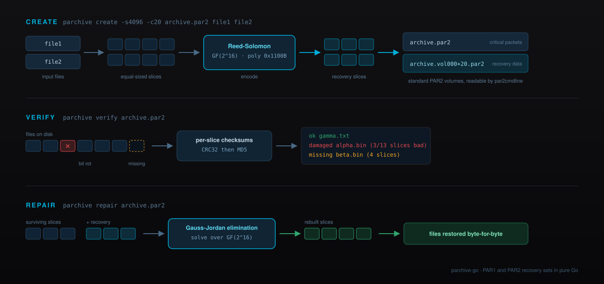
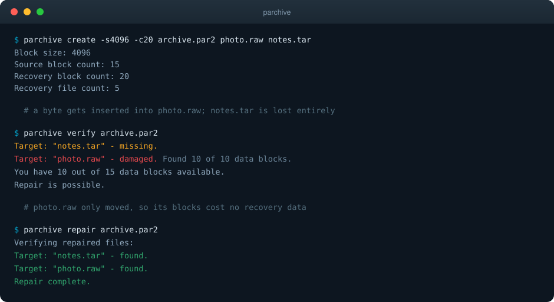

# Parchive-Go

Simple (yet complete) [PAR1](https://parchive.github.io/doc/Parity%20Volume%20Set%20Specification%20v1.0.html) and [PAR2](https://parchive.sourceforge.net/docs/specifications/parity-volume-spec/article-spec.html) recovery sets in pure Go 🛟



**Parchive-Go has been written for educational purposes and shouldn't be taken too seriously.** Use it at your own risk!

## Description

Built on top of the powerful [Go Programming Language](https://go.dev), Parchive-Go implements the [Parchive](https://parchive.github.io) formats end to end: packet serialisation, Reed-Solomon coding over GF(2^16) for PAR2 and GF(2^8) for PAR1, and the creation, verification and repair of recovery sets.

Parity files sit next to the data they protect. When bit rot flips a byte, a download truncates, or a file disappears altogether, the recovery volumes hold enough redundancy to rebuild what was lost, byte for byte. It is the trick Usenet has relied on for two decades, and it is just as useful for optical media, tape and cold archives.

The whole thing is around 1,700 lines of ordinary Go across two packages. No cgo, no assembly, no third-party modules, no vendored binaries: just the standard library, so it cross-compiles anywhere Go does.

### Features

- Full PAR2 support: create, verify and repair, reading and writing the real on-disk format
- Full PAR1 support, including the UTF-16 file names that format stores natively
- Reed-Solomon over GF(2^16) with the PAR2-mandated generator 2 and polynomial `0x1100B`
- Reed-Solomon over GF(2^8) with polynomial `0x11D` for PAR1
- Resynchronising packet scanner that skips damaged packets, so a partly corrupt `.par2` still works
- Per-slice CRC32 and MD5 verification, matching how the format detects damage
- Repair by Gauss-Jordan elimination, rebuilding damaged slices and fully missing files alike
- Memory bounded by slice size times recovery count, not by the size of the protected data
- Usable as a library or as a single self-contained `parchive` binary
- Zero third-party dependencies, `CGO_ENABLED=0`, every `GOARCH` Go supports

## Why another Parchive implementation?

The reference implementation, [par2cmdline](https://github.com/Parchive/par2cmdline), is excellent and very much alive - it shipped five releases in the sixteen months to August 2026. It is also GPL-2.0 and a command-line tool, which means a permissively licensed Go program cannot link it and has to fork a subprocess instead, sniffing `par2 -h` output to work out which flags the installed version understands. Debian stable still ships 0.8.1 while testing carries 1.3.0, so that subprocess behaves differently from host to host.

The Go side has been thin for a long time. [klauspost/reedsolomon](https://github.com/klauspost/reedsolomon), the de facto erasure-coding library, [declined to add a PAR2-compatible GF(2^16) engine](https://github.com/klauspost/reedsolomon/issues/72): *"I do not plan to add another since it will be inferior."* The closest thing to an incumbent, [akalin/gopar](https://github.com/akalin/gopar), covers both formats but has been dormant since 2021.

Parchive-Go does not try to be faster or more complete than par2cmdline. It aims to be the version you can simply `import`.

| | Parchive-Go | [akalin/gopar](https://github.com/akalin/gopar) | [par2cmdline](https://github.com/Parchive/par2cmdline) | [par2cmdline-turbo](https://github.com/animetosho/par2cmdline-turbo) |
| --- | --- | --- | --- | --- |
| Language | Go | Go | C++ | C++ |
| Licence | Apache-2.0 | BSD-3-Clause | GPL-2.0 | GPL-2.0 |
| PAR1 | `Yes` | `Yes` | `Repair only` | `Repair only` |
| PAR2 | `Yes` | `Yes` | `Yes` | `Yes` |
| Importable library | `Yes` | `Yes` | `Coarse (libpar2)` | `Coarse (libpar2)` |
| Third-party dependencies | `None` | `3` | `n/a` | `n/a` |
| Needs cgo | `No` | `No` | `n/a` | `n/a` |
| SIMD acceleration | `No` | `amd64 only` | `Yes` | `Yes` |
| Misaligned data recovery | `No` | `Yes` | `Yes` | `Yes` |
| Maintained | `Yes` | `Dormant since 2021` | `Yes` | `Yes` |

Where Parchive-Go genuinely differs is narrow and honest: it is the only Go implementation that creates *and* verifies *and* repairs both formats with no third-party modules and no cgo, under a permissive licence, in a codebase small enough to read in an afternoon. It is not the first pure-Go PAR2 library and it is not the fastest anything.

## Compatibility

Interoperability is the point, so it is tested rather than asserted. Every claim below was verified by round trip, in both directions, with the files compared byte for byte afterwards:

- **PAR2 against [par2cmdline-turbo](https://github.com/animetosho/par2cmdline-turbo) 1.5.0** - volumes written by Parchive-Go repair damaged and deleted files under `par2`, and Parchive-Go repairs sets that `par2` created
- **PAR1 against [akalin/gopar](https://github.com/akalin/gopar)** - the same round trip in both directions, including a file reconstructed from nothing
- **PAR1 against [par2cmdline](https://github.com/Parchive/par2cmdline) 1.3.0** - the reference implementation repairs PAR1 sets written by Parchive-Go, rebuilding a corrupted file and a deleted one in a single pass

The CI workflow runs the PAR2 half of this against the `par2` package on every push, so a regression breaks the build rather than someone's archive.

## Installation

Install the command line tool:

```bash
go install github.com/joamag/parchive-go/cmd/parchive@latest
```

Or add the library to a project:

```bash
go get github.com/joamag/parchive-go
```

Building from a checkout needs nothing but a Go toolchain:

```bash
git clone https://github.com/joamag/parchive-go.git
cd parchive-go
go build ./...
```

## Usage

The format follows the extension of the recovery file: `.par2` for PAR2, `.par` for PAR1.



### Create

```bash
parchive create -s 4096 -n 20 archive.par2 photo.raw notes.tar
```

`-s` is the slice size in bytes, which must be a multiple of 4, and `-n` is the number of recovery slices. Twenty slices of 4 KiB protect against roughly 80 KiB of damage, wherever it falls. Larger slices mean less bookkeeping but coarser recovery.

For a PAR1 set, name the output `.par` and drop `-s`, since PAR1 protects whole files rather than slices:

```bash
parchive create -n 5 archive.par photo.raw notes.tar
```

### Verify

```bash
parchive verify archive.par2
```

```text
  ok       photo.raw
  damaged  notes.tar (3/10 slices bad)
3 slices need repair, 20 recovery slices available
```

### Repair

```bash
parchive repair archive.par2
```

Damaged slices are rebuilt in place and missing files are recreated from scratch, as long as there are at least as many recovery slices as there are damaged ones.

### Library

Creating a recovery set:

```go
package main

import (
    "log"
    "os"

    "github.com/joamag/parchive-go/par2"
)

func main() {
    set, err := par2.Create([]string{"photo.raw", "notes.tar"}, 4096, 0, 20, "myapp")
    if err != nil {
        log.Fatal(err)
    }

    index, err := os.Create("archive.par2")
    if err != nil {
        log.Fatal(err)
    }
    defer index.Close()

    if err := set.WriteIndex(index); err != nil {
        log.Fatal(err)
    }
}
```

Verifying and repairing an existing one:

```go
set, err := par2.Parse("archive.par2", "archive.vol000+20.par2")
if err != nil {
    log.Fatal(err)
}

status, err := set.Verify(".")
if err != nil {
    log.Fatal(err)
}
for _, st := range status {
    if !st.OK {
        log.Printf("%s needs %d slices", st.File.Name, len(st.Damaged))
    }
}

if err := set.Repair("."); err != nil {
    log.Fatal(err)
}
```

The `par1` package mirrors this shape, with `par1.Create`, `par1.Parse`, `Verify` and `Repair`.

## How it works

Both formats build on the same idea: treat the data as a matrix over a finite field and store enough extra rows that any missing rows can be solved for.

PAR2 chops every input file into equal slices and numbers them globally. Each input slice `i` gets a constant `c_i`, chosen as `2^k` for successive `k` coprime with 65535 so that every constant has full multiplicative order. Recovery slice `e` is then the sum over all input slices of `c_i^e` times the slice data, computed in GF(2^16) with the polynomial `0x1100B`. Alongside the parity, the format records a CRC32 and an MD5 per slice, which is what makes verification cheap and damage detection precise.

Repair subtracts the surviving slices from the recovery slices, leaving a linear system whose unknowns are exactly the damaged slices. Gauss-Jordan elimination over the same field solves it, and the results are written back into place.

PAR1 is the older and blunter design: each *file* is one shard, zero padded to the length of the largest, and recovery volume `v` holds the sum over files of `(i+1)^(v-1)` times the file data in GF(2^8). Losing a 4 KiB file costs a whole volume the size of the biggest file in the set, which is precisely why PAR2 replaced it.

## Limitations

Stated plainly, because a data-integrity tool that oversells itself is worse than useless:

- **No misaligned data recovery.** Slices are only checked at their natural offsets. Insert or delete a single byte near the start of a file and every slice after it reads as damaged, where par2cmdline's sliding-window scan would recover them all. This is the biggest functional gap.
- **Single threaded, no SIMD.** Creation is roughly 11 times slower than par2cmdline-turbo. If throughput is what matters, use par2cmdline-turbo.
- **Repair holds the damaged file in memory** while it is rewritten, so a single file larger than RAM will not repair.
- **No subdirectories.** File names are taken as base names on creation.
- **No PAR2 Unicode Filename packets.** Non-ASCII names work in PAR1, which stores UTF-16 natively, but PAR2 sets use the ASCII name packet only.
- **No PAR3.** The specification is still unfinished.

## Benchmarks

Numbers are not the reason to pick this library, but hiding them would be worse. Measured on an Apple M-series laptop, 256 MiB input, 512 KiB slices, 20 recovery slices, best of three runs:

| | Parchive-Go | akalin/gopar | par2cmdline 1.3.0 | par2cmdline-turbo 1.5.0 |
| --- | --- | --- | --- | --- |
| Create | `3.79s` | `0.93s` | `1.90s` | `0.33s` |
| Verify | `0.36s` | `0.70s` | `1.19s` | `0.32s` |
| Repair | `1.74s` | `1.17s` | `2.56s` | `1.03s` |
| Peak memory, create | `28 MiB` | `379 MiB` | `13 MiB` | `30 MiB` |

Creation is the weak spot and by a wide margin, because encoding is scalar and single threaded. Verification is checksum bound rather than field-arithmetic bound, which is why it holds up. The memory column is the one worth dwelling on: gopar loads every input file into memory, so its footprint tracks the size of the archive, while Parchive-Go's tracks slice size times recovery count.

Reproduce with `go test -bench=. ./...`, or compare against other implementations directly.

## Security

Repairing a recovery set means writing files whose names came out of that set, and a `.par2` file travels with the data it protects. Parchive-Go rejects any file name that is absolute or that escapes the directory being repaired, rather than trusting it: the same class of issue as [GHSA-j5pc-g362-c5xp](https://github.com/Parchive/par2cmdline/security/advisories/GHSA-j5pc-g362-c5xp) in par2cmdline.

That guard is the only hardening claim made here. Repair still writes in place, so keep backups of anything irreplaceable.

## License

Parchive-Go is currently licensed under the [Apache License, Version 2.0](http://www.apache.org/licenses/).

## Build Automation

[](https://github.com/joamag/parchive-go/actions)
[](https://pkg.go.dev/github.com/joamag/parchive-go)
[](https://goreportcard.com/report/github.com/joamag/parchive-go)
[](https://www.apache.org/licenses/)
